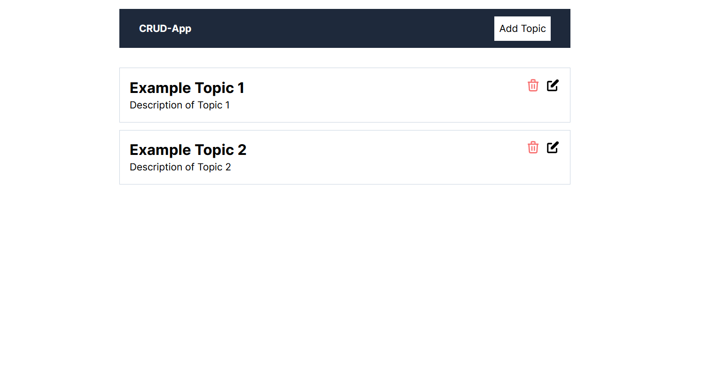
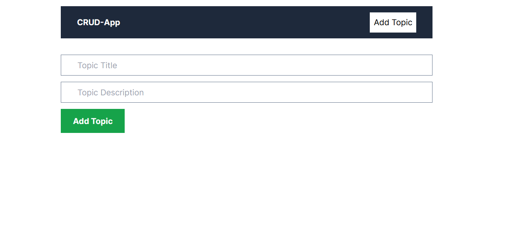

# Next.js MongoDB CRUD Project

## Introduction

This project is a simple CRUD (Create, Read, Update, Delete) application built with Next.js, MongoDB, Tailwind CSS, and TypeScript.

## API Routes

- **POST /api/create**: Create a new topic.
- **GET /api/read**: Retrieve all topics.
- **PUT /api/update/:id**: Update a topic by ID.
- **GET /api/get/:id**: Retrieve a topic by ID.
- **DELETE /api/delete/:id**: Delete a topic by ID.

## Screenshots

